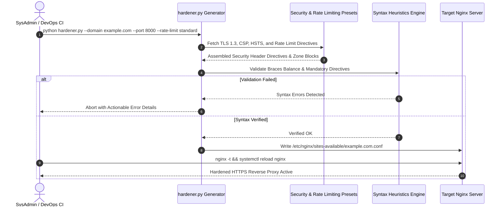

# 🔒 nginx-security-hardener

> **Topics:** `nginx` `security-hardening` `tls13` `hsts` `rate-limiting` `devops` `sysadmin` `ssl-certificate`


[](https://github.com/shadialhasan/nginx-security-hardener/releases/tag/v1.0.0)
[](LICENSE)
[](https://github.com/shadialhasan)
[](https://github.com/shadialhasan/nginx-security-hardener/actions)

An automated enterprise Nginx virtual host generator enforcing modern cryptographic standards (TLS 1.3, Mozilla modern cipher suites, HSTS Preload), sliding-window rate limiting zones, buffer overflow mitigation, clickjacking deterrence, and strict Content-Security-Policy.

---

## 🏗️ Configuration Flow Architecture

The following Mermaid sequence diagram outlines how the hardener compiles domain parameters, rate-limit policies, and security header presets into a production-ready virtual host configuration:



---

## ⚡ Features

- **Mozilla Modern SSL Profile**: Enforces TLS 1.2 and TLS 1.3 exclusively with forward secrecy ciphers (`ECDHE-ECDSA-AES128-GCM-SHA256`, `ECDHE-RSA-AES128-GCM-SHA256`).
- **Configurable Rate Limiting Presets**:
  - `strict`: 10 req/s, burst=20, 429 status code.
  - `standard`: 30 req/s, burst=50.
  - `relaxed`: 100 req/s, burst=150.
  - `off`: Rate limiting disabled.
- **Enterprise Security Header Presets**:
  - `strict`: Strict CSP, `Permissions-Policy`, COOP (`same-origin`), CORP (`same-origin`), COEP (`require-corp`), HSTS with preload, `X-Frame-Options: DENY`.
  - `standard`: Balanced production headers with `X-Frame-Options: SAMEORIGIN` and strict transport security.
  - `relaxed`: Foundational SSL and sniffing protection.
- **WebSocket Reverse Proxy Support**: Out-of-the-box `Upgrade` and `Connection "upgrade"` reverse proxy directives.
- **Automated Syntax Heuristics**: Pre-flight verification of balanced braces and mandatory directives before saving configuration files.

---

---

## ⚙️ Installation & Setup

```bash
git clone https://github.com/shadialhasan/nginx-security-hardener.git
cd nginx-security-hardener
pip install -r requirements.txt
```

## 🚀 Usage & Instructions

1. Copy environment example:
```bash
cp .env.example .env
```

2. Generate a hardened configuration:
```bash
python hardener.py --domain api.enterprise.com --port 8000 --rate-limit standard --security-preset strict
```

3. Deploy to Nginx:
```bash
sudo cp api.enterprise.com.conf /etc/nginx/conf.d/
sudo nginx -t && sudo systemctl reload nginx
```

---

## 🧪 Automated Testing

Execute the automated test suite verifying Nginx template rendering, rate-limit zones, header presets, and syntax validators:

```bash
python -m unittest discover -s tests -p "test_*.py" -v
```

---

## 👤 Author & Maintainer

**Eng. MHD. Shadi AL-Hasan**  
- **Role:** Executive CTO & Enterprise Solutions Architect  
- **Email:** [mhd.shadi.alhasan@gmail.com](mailto:mhd.shadi.alhasan@gmail.com)  
- **Phone / WhatsApp:** [+963934005922](tel:+963934005922)  
- **Location:** Damascus, Syria  
- **GitHub:** [shadialhasan](https://github.com/shadialhasan)  

---

## 📄 License

This project is licensed under the MIT License - see the [LICENSE](LICENSE) file for details.  
Copyright (c) 2026 **MHD. Shadi AL-Hasan**. All rights reserved.